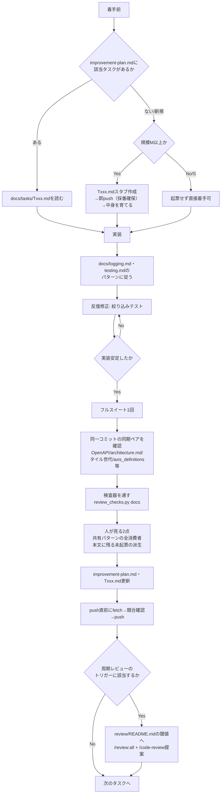

# プロジェクト作業フロー

RideCompassでの1タスクの一生を、着手前から完了・周期レビューまで通しで示す。
**個々のルールの本文はここに複製しない**——各段階で「どこを見るか」だけを示す
（ドキュメント階層の考え方はCLAUDE.md「ドキュメント階層」節参照）。

## 各段階の詳細な参照先

### 1. 着手前

- `docs/improvement-plan.md`で該当タスクの有無を確認する（CLAUDE.md冒頭）。
- 規模M以上なら**着手前の最初のコミットで**`docs/tasks/Txxx.md`を作成する
  （CLAUDE.md「コミット時の同期ルール」節）。
- 判断・実行を保留する場合は「後で判断」で済ませず、影響範囲を明記した完全なタスク
  エントリとして起票する（同節）。
- タスク番号は並行セッションと衝突しうる。スタブ→即push→中身を育てる、という手順・
  衝突時の振り直し手順は「作業ツリーの安全」節参照。
- **`docs/tasks/Txxx.md`には行頭が`状態:`で始まる行を必ず1本置く**（`規模S。状態: 完了`の
  ように規模と同じ行へ書くと検出されない）。`scripts/review_checks.py docs`が
  `improvement-plan.md`の`[x]`/`[ ]`とこの行を突き合わせるため、無い・行頭でない場合は
  照合できず違反になる。語は`完了`/`未着手`/`保留`/`見送り`等から選ぶ——`見送り`は
  「今後もやらない確定判断」で`[x]`側、トリガー待ちは`保留`で`[ ]`側
  （語の分類は`review_checks.py`の`OPEN_STATUS_WORDS`/`CLOSED_STATUS_WORDS`）。

### 2. 実装中

- ログ方針は`docs/logging.md`、テストパターンは`docs/testing.md`（CLAUDE.mdは要点＋
  ポインタのみ）。
- 反復修正フェーズは絞り込みテスト、フルスイートは実装が安定した最後の1回だけ
  （CLAUDE.md「テスト方針」節）。
- 並行セッションが同じ作業ツリーを触りうる。自分が変更していないファイルの変更を
  見つけても絶対に自動で戻さない（「作業ツリーの安全」節）。
- **バックグラウンドAgentを使う場合は`isolation: "worktree"`を必ず指定する**
  （2026-08-30、T414実装時に指定を忘れ、同じ作業ツリーを共有してしまった実績を受け
  CLAUDE.md「作業ツリーの安全」節へ明文化済み）。
- **背景Agentの成果をmasterへ反映した後、実機確認する前にローカルのpreview
  devサーバー（backend/frontend）を明示的に再起動する**（`.claude/launch.json`の
  起動コマンドは`--reload`無しのため自動では新コードを拾わない。2026-08-30、
  T423マージ直後にbackend再起動を忘れ、新設エンドポイントが404を返す状態を
  一時的に「実装のバグ」と誤診断しかけた実績あり）。

### 3. 完了直前（同一コミットで同期すべきペア）

規模M以上でAPI・ドメイン概念・レイヤー種を新設した場合や、以下に該当する変更をした
場合は、CLAUDE.md「コミット時の同期ルール」節の該当項目を確認する:
OpenAPI生成物／`docs/architecture.md`／MVTタイル世代定数／`axis_definitions`の
変更経路（migrationではなくAPI経由）／本番DBのデータ移行順序。

### 4. 完了と判定する直前

- **docs・タスク台帳・ソースコードの整合性**は`scripts/review_checks.py docs`が落とす
  （pre-commitとCIが自動で走る。強制範囲の正本は同ファイルの`DETECTOR_ENFORCEMENT`で、
  ここにも CLAUDE.md にも書き写さない）。
- **人が見るしかないのは2点だけ**: ①共有フィールド・パターンを変更/廃止したときの全消費者
  grep（取り残しと、変更後の契約との両立の両方）、②タスクを`[x]`化するときに本文へ残って
  いる未実施の派生を別Txxxへ起票すること。どちらも実行したgrepと観測値をコミット
  メッセージへ残す。
- **直し方そのものはCLAUDE.md「修正の原則」節に従う**（範囲は性質から導く／検証は別の
  入力で行う／緩和は影響を測ってから入れる／「効いている」を見てから完了にする）。

### 5. push直前

`git fetch origin master`をもう一度行い、タスク番号・変更の競合が無いか確認してから
push する（「作業ツリーの安全」節）。

### 6. 周期レビュー（該当タスクだけでなくプロジェクト全体に対して随時）

`.claude/commands/review/README.md`「定期的なレビュー」節のトリガー
（前回レビューから14日 or 実装コードの変更20,000行のどちらか早い方、または分割元タスク
完了直後。`python scripts/review_checks.py trigger`で判定）に該当するかを確認する。該当すれば`/review:all`（最低限`/review:consistency`）を実施し、
`/code-review`（本物、ユーザー起動）も提案する。忘れられがちな`/code-review`の代替として
セッション自身の自己レビュー（`codereview-self`）も選択肢にある。指摘の起票は
ユーザー承認後（`review/README.md`参照）。
